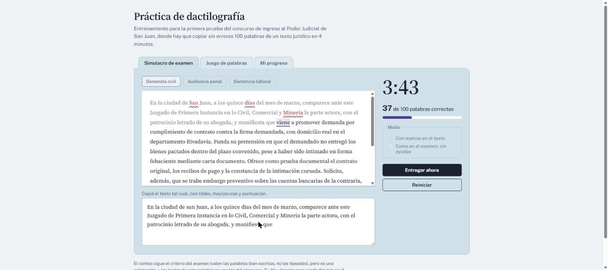
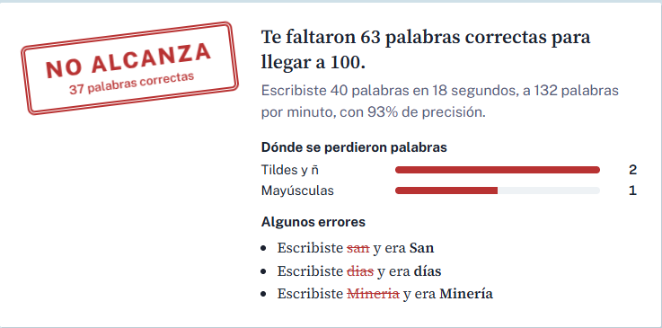
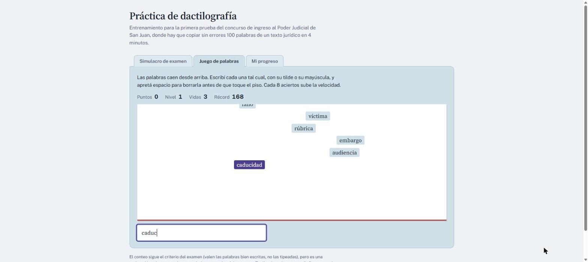
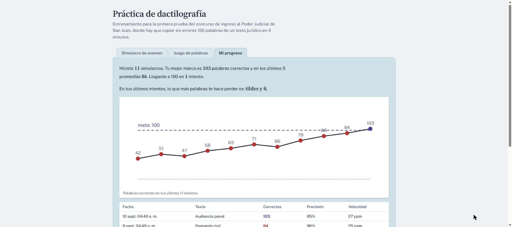

# Práctica de dactilografía

Entrenador para la prueba de dactilografía del **concurso de ingreso al Poder Judicial de San Juan**: hay que copiar **100 palabras sin errores de un texto jurídico en 4 minutos**, y solo cuentan las palabras escritas exactamente igual que en el original, con su tilde, su mayúscula y su puntuación.

La aplicación reproduce esa consigna: cronometra, corrige con el mismo criterio, muestra dónde se pierden las palabras y guarda la evolución de cada intento.

[](https://github.com/EdgLuceroC/dactilografia/actions/workflows/ci.yml)
[](LICENSE)
[](https://react.dev)
[](https://vite.dev)



---

## Qué incluye

### Simulacro de examen

- Reloj de 4 minutos que arranca con la primera tecla, no con un botón.
- Tres escritos judiciales incluidos (demanda civil, audiencia penal, sentencia laboral).
- Corrección palabra por palabra: cada una queda marcada como correcta, equivocada o salteada.
- **Modo examen**, sin marcas ni contador, para practicar en las mismas condiciones que en la sede.
- Pegar está deshabilitado, igual que en la prueba real.

### Diagnóstico del intento

Al entregar, el resultado separa los errores en seis categorías —tildes y ñ, mayúsculas, puntuación, letras cambiadas, palabras salteadas y palabras de más—, muestra ejemplos concretos de lo que se escribió y detecta las letras que más se escapan.



### Juego de palabras

Vocabulario judicial que cae desde arriba y hay que tipear con su tilde y su mayúscula antes de que toque el piso. La velocidad sube cada ocho aciertos. Sirve para automatizar las palabras difíciles sin la presión del cronómetro.



### Progreso

Gráfico de palabras correctas por intento contra la línea de la meta, promedio de los últimos simulacros, mejor marca y el tipo de error que más palabras cuesta. Todo se guarda **en el navegador**: no hay cuentas, ni servidor, ni datos que salgan de la máquina.



<sub>Los datos del gráfico son de ejemplo, para mostrar cómo se ve la sección con varios intentos cargados.</sub>

### IA (opcional)

Con un endpoint configurado se habilitan dos funciones extra: generar textos jurídicos nuevos y pedir una devolución escrita sobre el último intento, con textos que apuntan justo a los errores cometidos. **Sin configurar nada, la aplicación funciona completa**; solo se ocultan esos dos botones. Ver [docs/ia.md](docs/ia.md).

---

## Arranque rápido

Requiere [Node.js](https://nodejs.org) 20 o superior.

```bash
git clone https://github.com/EdgLuceroC/dactilografia.git
cd dactilografia
npm install
npm run dev
```

Queda en <http://localhost:5173>.

Para la versión de producción:

```bash
npm run build     # genera dist/
npm run preview   # sirve dist/ para revisarlo
```

---

## Scripts

| Script                  | Qué hace                                        |
| ----------------------- | ----------------------------------------------- |
| `npm run dev`           | Servidor de desarrollo con recarga en caliente. |
| `npm run build`         | Compila a `dist/`.                              |
| `npm run preview`       | Sirve lo compilado.                             |
| `npm test`              | Corre las pruebas una vez.                      |
| `npm run test:watch`    | Pruebas en modo continuo.                       |
| `npm run test:coverage` | Pruebas con informe de cobertura.               |
| `npm run lint`          | ESLint sobre todo el proyecto.                  |
| `npm run format`        | Prettier sobre todo el proyecto.                |

---

## Estructura

```
dactilografia/
├── api/
│   └── ia.js                  # Proxy serverless: guarda la clave del lado del servidor
├── docs/
│   ├── img/                   # Capturas del README
│   ├── arquitectura.md        # Cómo está armado y por qué
│   ├── correccion.md          # El algoritmo de corrección, en detalle
│   ├── ia.md                  # Configurar (o no) la IA
│   └── despliegue.md          # Pages, Vercel, Netlify
├── public/
│   └── favicon.svg
├── src/
│   ├── components/            # Interfaz
│   │   ├── Simulacro.jsx      #   examen cronometrado
│   │   ├── HojaTexto.jsx      #   texto a copiar, con marcas
│   │   ├── Tablero.jsx        #   reloj, contador, modo y acciones
│   │   ├── Resultado.jsx      #   sello y desglose de errores
│   │   ├── Juego.jsx          #   palabras que caen
│   │   ├── Progreso.jsx       #   evolución de los intentos
│   │   ├── GraficoProgreso.jsx
│   │   └── TablaIntentos.jsx
│   ├── data/                  # Contenido editable sin tocar lógica
│   │   ├── textos.js          #   escritos judiciales incluidos
│   │   ├── temas.js           #   temas que se le piden a la IA
│   │   └── palabras.js        #   vocabulario del juego
│   ├── hooks/
│   │   ├── useHistorial.js
│   │   └── useRecord.js
│   ├── juego/
│   │   ├── motor.js           # Lógica pura del juego
│   │   └── motor.test.js
│   ├── lib/                   # Núcleo sin React
│   │   ├── correccion.js      #   alineación y conteo de palabras
│   │   ├── texto.js           #   normalización y formato
│   │   ├── estadisticas.js    #   resúmenes del historial
│   │   ├── almacenamiento.js  #   persistencia local
│   │   ├── ia.js              #   cliente de la IA
│   │   └── prompts.js         #   prompts, separados de la interfaz
│   ├── styles/                # CSS por sección
│   ├── config.js              # Meta, duración y claves
│   ├── App.jsx
│   └── main.jsx
└── index.html
```

La lógica que decide si una palabra cuenta vive en `src/lib/` y `src/juego/`, sin depender de React ni del DOM: por eso se puede probar de verdad. Los componentes solo dibujan. Ver [docs/arquitectura.md](docs/arquitectura.md).

---

## Cómo se cuentan las palabras

Copiar es un renglón de texto, pero corregirlo no es comparar palabra número tres contra palabra número tres: si alguien saltea una palabra, todo lo que sigue quedaría marcado mal.

La corrección alinea lo escrito con el original usando distancia de edición sobre palabras, y como el intento casi nunca llega al final, compara contra el tramo del texto que mejor coincide. Después clasifica cada diferencia en la categoría más específica que la explique: primero tilde, después mayúscula, después puntuación y recién al final "letras cambiadas".

El detalle, con ejemplos, está en [docs/correccion.md](docs/correccion.md).

---

## Pruebas

```bash
npm test
```

44 pruebas sobre la corrección, la normalización de texto, el motor del juego y las estadísticas: los cuatro lugares donde un error se traduce en un puntaje equivocado.

---

## Despliegue

Es un sitio estático: sirve cualquier hosting. El repositorio trae un flujo de trabajo listo para **GitHub Pages** y las instrucciones para **Vercel** y **Netlify** —los dos únicos que además pueden hostear el proxy de IA— en [docs/despliegue.md](docs/despliegue.md).

---

## Advertencia

Los textos de práctica son ficticios y **no son los del concurso**. El conteo sigue el criterio del examen, pero es una estimación hecha por software: no sustituye a la corrección oficial. El cronograma y las condiciones de la prueba están en el [sitio del Poder Judicial de San Juan](https://www.jussanjuan.gov.ar/ingreso2026/dactilografia/).

---

## Contribuir

Las mejoras son bienvenidas, sobre todo textos de práctica nuevos y vocabulario para el juego. Ver [CONTRIBUTING.md](CONTRIBUTING.md).

## Licencia

[MIT](LICENSE).
